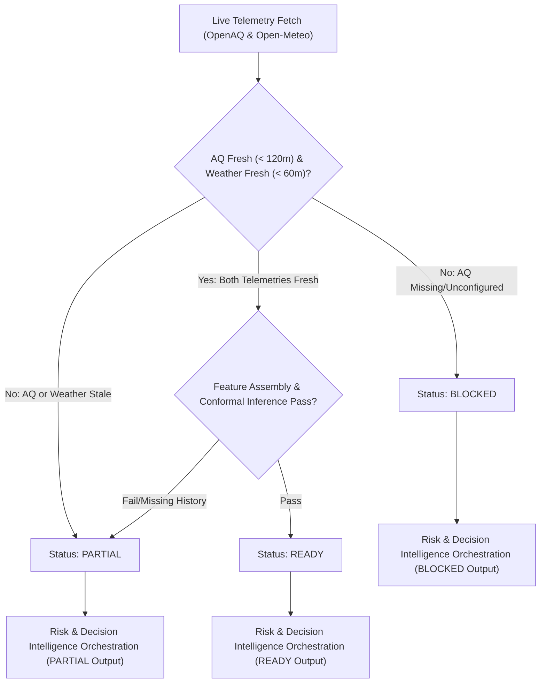

# VayuDrishti — Controlled Live Pilot Readiness & Freshness Verification
**Phase Title:** PHASE 1E-J2E.4.9 — CONTROLLED LIVE PILOT READINESS & FRESHNESS VERIFICATION  
**Project:** VayuDrishti — Clean Air & Climate Resilience  
**Scope:** Anand Vihar 8118 Pilot Station (`ANAND_VIHAR_8118`)  
**Status:** Controlled Live Pilot Ready (Not Production Validated)

---

## 1. Executive Summary & Scientific Limitations

This document establishes the architecture, freshness auditing rules, and data quality gates for the **VayuDrishti Controlled Live Pilot Readiness Verification**.

### ⚠️ Permanent Scientific & Operational Limitations
1. **Model Training Baseline**: The LightGBM forecasting models (+1h, +3h, +6h) were trained on historical telemetry from **January 2025** at the Anand Vihar 8118 station.
2. **Production Validation Status**: Live 2026 inference outputs **MUST NOT** be described or marketed as production-validated. The system enforces a constant `production_validation_status = "NOT_PRODUCTION_VALIDATED"`.
3. **No Retraining / No Calibration**: Model weights, feature ordering, conformal prediction radii, risk scoring formulas, and decision rules remain **permanently frozen**.
4. **Non-Causal & Non-Medical Disclaimer**: All outputs are decision-support indicators for authority review. The system does not assert legal liability or medical diagnoses.

---

## 2. Live Data Providers & Authentication Behavior

The controlled live pilot orchestrator leverages existing backend provider infrastructure without introducing duplicate data access code:

| Provider | Data Source | Protocol / Endpoint | Freshness Threshold | Authentication |
| :--- | :--- | :--- | :--- | :--- |
| **Air Quality** | OpenAQ REST API v3 | `GET /v3/sensors/{sensor_id}/hours` | **120 minutes** | `OPENAQ_API_KEY` header (`X-API-Key`) |
| **Weather** | Open-Meteo REST API | `GET /v1/forecast` (hourly) | **60 minutes** | Unauthenticated public API |

### Credential Handling & Safety
- `OPENAQ_API_KEY` is retrieved strictly from the environment (`os.getenv("OPENAQ_API_KEY")`).
- **No Hardcoding**: API keys are never stored in source code, artifacts, frontend code, or git history.
- **Graceful Unconfigured Handling**: If `OPENAQ_API_KEY` is absent, the system does not fail with unhandled exceptions. Instead, `LiveAirQualityProvider` returns `status = "LIVE_AQ_UNAVAILABLE"` and logs `CONTROLLED LIVE EXECUTION BLOCKED — OPENAQ_API_KEY NOT CONFIGURED`.
- **Zero Fabrication**: The system never invents fake sensor readings when live data is missing or stale.

---

## 3. Freshness & Data Quality Gates

The pipeline enforces deterministic quality states (`READY`, `PARTIAL`, `BLOCKED`) following strict precedence:
$$\text{BLOCKED} > \text{PARTIAL} > \text{READY}$$



### Freshness Rules
- **Air Quality Age**: $\text{age}_{\text{AQ}} = t_{\text{prediction}} - t_{\text{latest\_observation\_AQ}} \le 120\text{ minutes}$.
- **Weather Age**: $\text{age}_{\text{Wx}} = t_{\text{prediction}} - t_{\text{latest\_observation\_Wx}} \le 60\text{ minutes}$.
- **Overall Freshness**: $\text{fresh}_{\text{overall}} = \text{fresh}_{\text{AQ}} \land \text{fresh}_{\text{Wx}}$.

---

## 4. End-to-End Composition Pipeline

The `ControlledLivePilotOrchestrator` (`ml/src/decision/live_pilot_orchestrator.py`) composes the entire intelligence chain into one reproducible artifact:

1. **Telemetry Acquisition**: `LiveAirQualityProvider` + `LiveWeatherProvider`.
2. **Local Caching**: Writes atomic JSON files to `data/processed/forecasting/live/`.
3. **Feature Assembly**: `ForecastFeatureAssembler` constructs the 27-feature vector, enforcing zero temporal leakage ($t_{\text{observation}} \le t_{\text{prediction}}$).
4. **Model Inference**: `ForecastInferenceEngine` computes LightGBM predictions for +1h, +3h, and +6h with conformal prediction bounds.
5. **Risk Assessment**: `RiskAssessmentEngine` calculates multi-horizon severity, persistence, and uncertainty scores.
6. **Action Recommendations**: `ActionRecommendationEngine` generates operational authority guidance.
7. **Decision Orchestration**: `DecisionIntelligenceEngine` binds all outputs with mandatory human review (`requires_human_review = true`).
8. **Artifact Persistence**: Atomically outputs `data/processed/decision/live_pilot_decision.json`.

---

## 5. Live vs. Historical Provenance Labeling

To ensure complete transparency during pilot evaluations, all artifacts explicitly state telemetry provenance:

```json
{
  "data_mode": "CONTROLLED_LIVE",
  "production_validation_status": "NOT_PRODUCTION_VALIDATED",
  "station_id": "ANAND_VIHAR_8118",
  "overall_status": "READY",
  "freshness_metadata": {
    "air_quality_fresh": true,
    "weather_fresh": true,
    "overall_live_fresh": true,
    "air_quality_age_minutes": 14.5,
    "weather_age_minutes": 10.2,
    "max_aq_age_allowed_minutes": 120.0,
    "max_weather_age_allowed_minutes": 60.0
  },
  "cache_provenance": {
    "live_cache_dir": "data/processed/forecasting/live",
    "artifact_path": "data/processed/decision/live_pilot_decision.json",
    "air_quality_source": "OpenAQ_v3_Live",
    "weather_source": "Open-Meteo_Live"
  }
}
```

---

## 6. Testing & Validation Summary

Focused test suite: `tests/test_live_pilot_readiness.py` (22+ unit and integration tests).
- Verifies fresh, stale, and missing AQ telemetry.
- Verifies fresh, stale, and missing weather telemetry.
- Verifies status precedence (`BLOCKED > PARTIAL > READY`).
- Verifies `NOT_PRODUCTION_VALIDATED` invariant enforcement.
- Verifies missing API key handling without credential leaks or crashes.
- Verifies atomic artifact creation and temporal leakage prevention.
